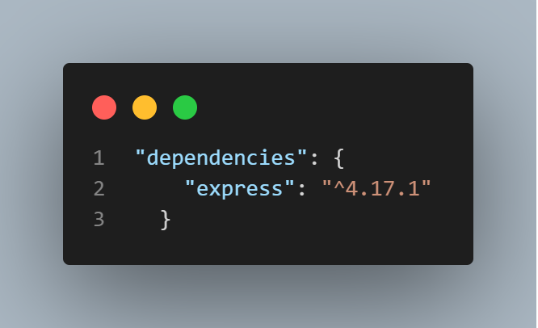

Instalasi ExpressJs
=================

Sebelum menginstall ExpressJs, saya asumsikan kalian sudah menginstall NodeJs. Jika belum kalian bisa klik link [ini](https://nodejs.org/en/) untuk menginstallnya.

Langkah pertama buka command prompt atau bisa kita lakukan dengan windows + r kemudian ketik cmd.
```
mkdir apk
cd apk
```
Lalu kita gunakan *npm init* untuk membuat file *package.jsonfile* di aplikasi kita. Jangan lupa setelah melakukan *npm init*, kita tekan enter saja untuk pengaturan default sampai muncul tulisan *yes*. Lalu tekan yes.
```
npm init
```
Selanjutnya kita install express di folder *apk* yang sudah kita buat tadi.
```
npm install express
```

Untuk mengecek apakah express kita sudah terinstall atau belum kita bisa buka file *package.json*, lalu kita liat dibagian *dependencies*. Jika sudah maka hasilnya akan seperti dibawah ini.
