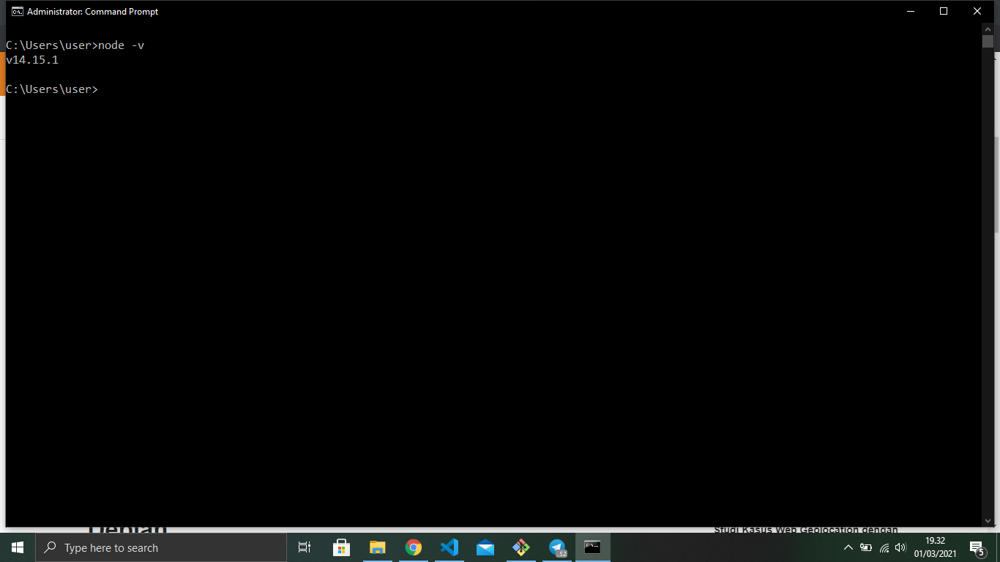

Instalasi Node.js
=================

cara menginstall node js cukup mudah tinggal mengunjungi website resmi milik node js yaitu di https://nodejs.org. Silahkan download sesuai dengan sistem operasi yang kamu gunakan.

 

Sebaiknya kamu memilih versi LTS yang memiliki dukungan lebih lama. Silakan ikuti saja panduan instalasinya pada installer yang kamu download tersebut.

kemudian untuk mengecek apakah nodejs kita sudah terinstall apa belum, cukup buka terminal lalu ketikkan perintah berikut
```
node -v 
```
setelah itu tekan enter maka akan tampil seperti yang dibawah ini

