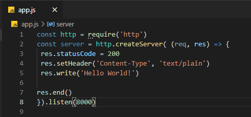

# Menjalankan "Hello World"

Untuk menampilkan teks hello world menggunakan NodeJS, caranya adalah
1. buat sebuah file javascript dengan nama app.js yang berisi kode sebagai berikut.

CreateServer fungsi ini juga memiliki setidaknya dua argumen yaitu req (request) dan res (response). Argumen req untuk menangkap request dari luar, sedangkan argumen res untuk merespon request ke luar.

Untuk menampilkan hello world caranya, melalui terminal, jalankan perintah node app.js

Catatan: jika terjadi error maka mungkin port 8000 pada komputermu telah digunakan oleh aplikasi lain, ubah saja ke kode port lain.

Atau kita bisa akses alamat URL tersebut menggunakan Postman yang mana secara default method dari URL tersebut adalah GET.

