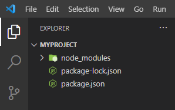

# Menjalankan "Hello World"

Untuk menampilkan teks hello world menggunakan NodeJS, caranya adalah
1. Membuat folder. Pada modul ini, folder yang akan digunakan adalah folder myProject.
2. Buka aplikasi Visual Studio Code dan pilih tombol Open folder, dan arahkan ke folder myProject.
3. Inisialisasi daftar package dengan syntax **npm init**, tekan enter untuk semua pilihan default.
4. Instalasi framework node.js yaitu express.js dengan syntax **npm install express**.
Hasil dari semua package 

5. selanjutnya kita membuat file baru di dalam project kita dengan nama **app.js**. Oke kalau kita sudah buat file app.js kita buat program sederhana denga express.js. caranya isi coding di file app.js seperti berikut

6. Jalankan server dengan mengetikan syntax **node app.js** di terminal.

7. cara menjalankannya buka web browser, silakan akses alamat URLnya: http://localhost:1010

Atau kita bisa akses alamat URL tersebut menggunakan Postman yang mana secara default method dari URL tersebut adalah GET.

